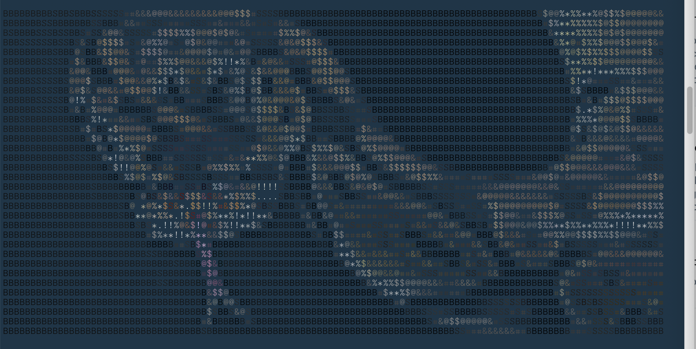

NetImages - tool for sniffing images over HTTP traffic and showing them on the console.
Designed for remote shells.

Uses an 8-bit greyscale for relaying over telnet, file pipes, etc.

Uses ANSI 256 color codes for relaying on a color-supported shell (e.g. Xterm)

Supports either a recorded PCAP file (from Wireshark or similar), or listening to traffic on a specified interface.

## Usage

```console
usage: netimages [-h] [-i IFACE] [--no-colors] [pcap]

NetImages - tool for sniffing images over HTTP traffic and showing them on the console. Designed for remote shells

positional arguments:
  pcap                  Path to a pcap file

optional arguments:
  -h, --help            show this help message and exit
  -i IFACE, --iface IFACE
                        Interface to capture
  --no-colors           No ANSI colorings
```

## Screenshot


